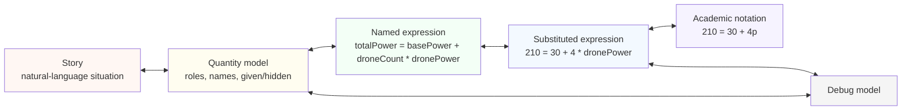

# Product vision and learning loop

## Purpose

Create a browser-based, test-driven puzzle game that trains translation between representations of mathematics. A learner may solve `4x + 30 = 210` confidently but struggle to construct it from a description, explain the model, or work backward from notation. Treat those as distinct skills and expose the intermediate steps.

The first playable artifact is a graybox puzzle loop. Procedurally generated problems supply replayability. A roguelike, city map, creator scenario, or other thematic shell may consume the same core later.

## Representation graph



Initial node definitions:

- **Story:** natural-language situation containing all relevant facts, relationships, and a question.
- **Quantity model:** semantic roles, well-named identifiers, given values, hidden unknowns, and optional units.
- **Named expression:** `totalPower = basePower + droneCount * dronePower`.
- **Substituted expression:** `210 = 30 + 4 * dronePower`.
- **Academic notation:** rendered `210 = 30 + 4p`, with an explicit `dronePower -> p` mapping.

The game chooses a source node, target node, and check policy for each puzzle. It can traverse a single edge or a short path in either direction. The engine tracks the edge being trained rather than reducing every result to a single arithmetic score.

A canonical problem contains meaning; a puzzle specifies which portion is visible, what the player needs to produce, and how to assess it. A rendered story is one projection of the problem rather than its authority.

## Reference example

Story: "A ship uses 30 MW for basic systems. Four identical drones are active. Together they draw 210 MW. How much power does one drone draw?"

```
basePower = 30 MW
droneCount = 4
dronePower = ? MW
totalPower = 210 MW

totalPower = basePower + droneCount * dronePower
210 = 30 + 4 * dronePower
210 = 30 + 4p
p = 45 MW
```

Make the unknown interpretable: the answer `45` means power per drone, rather than an unnamed number. Academic compression happens after the meaning is established.

## Puzzle contract

```
Puzzle = source representation + target representation + visible facts
       + expected semantic answer + check policy + learning concepts
```

Supported directions in the initial graybox:

1. Story -> identify quantities and unknown.
2. Quantity model -> construct named relation.
3. Named relation -> substituted/academic expression.
4. Academic expression -> named relation.
5. Named model -> select matching story, with structure-based distractors.

The fifth transition uses a choice of authored/generated texts in Phase 1. A later phase can accept free-form story writing after a validation strategy exists.

## Learner-facing feedback

Describe the consequence of a model, particularly when it is structurally wrong. For example, `droneCount * (dronePower + basePower)` applies the base power once per drone. This can be shown as an explanation of the model rather than merely a wrong-answer flag.

Distinguish parser failure, invalid references, dimension mismatch, wrong semantic relationship, equivalent-but-differently-written expressions, and errors in arithmetic when a relevant checker supports them. Early iterations may classify only the cases needed by the first puzzle.

## Success criteria for the prototype

A learner can finish a short run in the browser, move in more than one direction along the representation graph, see meaningful feedback for one common misconception, and practice with fresh reproducible instances. The system can explain or print every puzzle independently of the UI. Initial evaluation should ask whether players understand the task and whether success differs by representation edge, rather than claiming an educational effect from the prototype alone.
