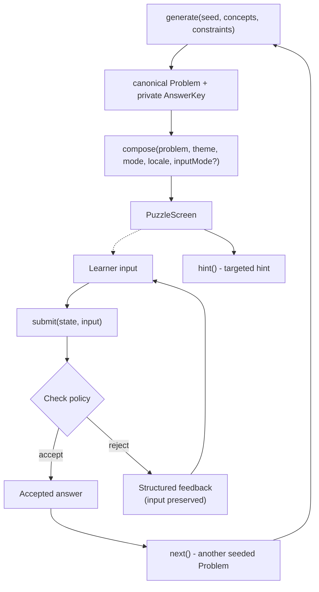
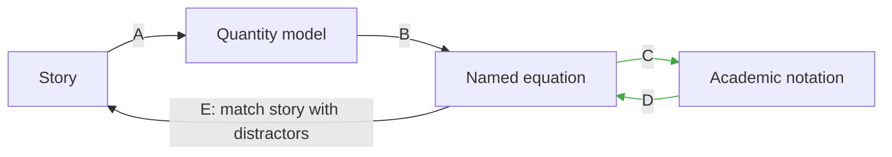

# Graybox core puzzle loop

## Single-screen layout

Build one accessible, low-decoration screen. The use-case owns the screen model and its transitions. Lit receives the model, renders it, and forwards commands. The plain-text printer takes the same screen model for use-case approvals.

```
┌────────────────────────────────────────────────────────────┐
│ Puzzle 2/6  ·  Seed 918273  ·  Story → Quantities           │
├────────────────────────────────────────────────────────────┤
│ SOURCE                                                     │
│ A ship uses 30 MW ...                                      │
├────────────────────────────────────────────────────────────┤
│ TARGET: Identify known quantities and the unknown.        │
│ [basePower = 30] [droneCount = 4] ...                     │
│                                                            │
│ [Check]   [Hint]   [New problem]                            │
├────────────────────────────────────────────────────────────┤
│ FEEDBACK: ...                                              │
├────────────────────────────────────────────────────────────┤
│ Developer view: AST / solution / DSL / check trace         │
└────────────────────────────────────────────────────────────┘
```

The debug section is development-only and receives privileged answer-key data intentionally. The learner-facing screen model contains visible facts, puzzle instructions and submitted input; keep keys and correct answers on an explicitly distinct boundary.

## State transition contract

Separate mathematical generation from learner-facing composition:



Each command should have a deterministic use-case printer. Favor actions that can be tested without mounting the UI.

The browser replay URL may retain the compatibility names `seed`, `scenario`, `task`, and `locale`, but `scenario` selects a Theme and `task` selects a Mode. Changing Theme, Mode, locale or input provider reuses the exact canonical Problem; changing only the mathematical seed generates another Problem.

## First five puzzle types



### A. Story -> quantities

Show the active Theme's story from shared puzzle context. Present candidate quantity/label/value chips and let the player identify the givens and hidden role. Checking compares semantic IDs and facts, not rendered string formatting. Add plausible distractors once the basic interaction works.

### B. Quantities -> named equation

Keep the same Theme story visible as context and show the active Theme's learner-facing names for the canonical quantities. A drone Theme may render:

```text
basePower = 30
droneCount = 4
dronePower = ?
totalPower = 210
```

while a creator Theme renders the same canonical Problem with follower/post names. Ask for the same canonical relation expressed through the active name map.

Start with a plain expression field using the Ohm expression parser. The UI can later support draggable tokens or structured editor operations using the same command/checking interface.

### C. Named equation -> academic notation

Given the named equation and symbol mapping `dronePower -> p`, request `210 = 30 + 4*p` in a simple textual input. Show the formatted result through KaTeX as `210 = 30 + 4p`. Check parsed AST semantics and explicit symbol resolution.

### D. Academic notation -> named equation

Give `210 = 30 + 4p` plus the quantity/symbol key and ask for the named semantic relationship. This proves reverse traversal.

### E. Named model -> matching story

Present the same relation and multiple situations with realistic structural distractors. A distractor describing a fee charged for every drone corresponds to `count * (unitValue + base)`, while the correct model includes the base once. Use deterministic scenario templates and approve a printed set of alternatives.

## Feedback cases for the first slice

- Valid normalized structure -> confirm the relationship and show the interpreted roles.
- Parse error -> identify the unexpected token and position.
- Unrecognized quantity -> show which identifiers are available.
- `count * (unit + base)` -> explain that the fixed/base amount is counted once per unit.

Introduce new categories alongside corresponding failing tests. Preserve user input and the source representation on a failed check so the learner can revise the model.

## Shared screen contract

`PuzzleScreen` is common composition output, not the name of one concrete representation edge. It carries shared context such as localized story and replay selection plus a discriminated task-specific state. A source kind like `quantities` belongs inside the Quantities -> Named Equation variant, not at the root of the generic screen contract.

Free-text and multiple-choice controls are input providers for the same named-equation Mode and therefore share the same story, quantity presentation and checker semantics.

## Readable screen-model printer

An example of the output to approve (illustrative, exact format determined by first test):

```text
Puzzle 01/06 | seed=918273 | Quantities -> NamedExpression
Concepts: arithmetic.addition, arithmetic.multiplication, linear.one-unknown
Source:
  basePower = 30 MW
  droneCount = 4 drones
  dronePower = ? MW/drone
  totalPower = 210 MW
Prompt: Construct the equation using the quantity names.
Answer: totalPower = droneCount * (dronePower + basePower)
Check: structural-mismatch
Feedback: Your model applies basePower once per drone; the base cost applies once.
```

The printer reflects actual returned use-case data in the test, including the submitted answer and diagnostic. It does not produce a manually duplicated narrative of how the application should have behaved.

## UI accessibility and DOM tests

Use semantic headings, real labels, buttons, descriptions, and feedback announcements. Support keyboard completion. Test interaction through accessible labels/roles and observable feedback. For Lit DOM approval, await render completion, select a stable subtree (including shadow root as needed), remove irrelevant generated identifiers, and serialize deterministically. An approval of HTML complements, rather than replaces, interaction assertions and accessibility checks.

## Initial session

Once individual puzzles work, compose roughly 5–10 generated transformations and display per-edge completion counts. The first implementation uses no scoring economy, accounts, map or adaptive system. A useful session printer approves the sequence and outcome while property tests ensure all puzzle instances remain valid.
