# Phase 1 execution plan — small test-driven steps

**Goal:** validate the mathematical/representation engine with one generated schema, two coherent story themes, deterministic printers, a real graybox UI, and reverse-direction puzzles. Each milestone ends with observable working behavior and a test report. Start with a thin vertical slice; grow language and generator capabilities only when needed.

## Progress overview

```mermaid
flowchart LR
    subgraph Done["Done: engine foundation"]
        M0["M0 Compatibility/tooling spike"]
        M1["M1 Semantic case"]
        M2["M2 First use-case"]
        M3["M3 Parse learner expressions"]
        M4["M4 Minimal DSL"]
        M5["M5 Procedural generator"]
        M6["M6 First theme/story"]
        M7["M7 Second theme"]
    end
    subgraph Current["Current correction"]
        M75["M7.5 Problem × Theme × Mode composition<br/>(GitHub issue #19)"]
    end
    subgraph Next["Next milestones"]
        M8["M8 Substitution & academic display"]
        M9["M9 Misconception feedback"]
        M10["M10 Short graybox session"]
    end

    M0 --> M1 --> M2 --> M3 --> M4 --> M5 --> M6 --> M7 --> M75 --> M8 --> M9 --> M10

    style M75 fill:#fffbe6,stroke:#b8a135,stroke-width:3px
    style M8 fill:#f3f9ff,stroke:#888,stroke-dasharray: 4 3
    style M9 fill:#f3f9ff,stroke:#888,stroke-dasharray: 4 3
    style M10 fill:#f3f9ff,stroke:#888,stroke-dasharray: 4 3
```

Solid nodes are implemented behavior, the yellow node is the active architecture correction (issue #19), and dashed nodes are planned next. Milestone 8 waits behind that correction.

## Milestone 0 — Compatibility and tooling spike

**First red test:** an approval of a fixed text string has no baseline and produces a reviewable `.received.txt`; after explicit human approval it passes and a changed string produces a useful diff.

- Scaffold TypeScript + Vite + Lit + Vitest + fast-check and Ohm/JS/KaTeX dependencies as needed.
- Integrate `approvals` through one test helper; validate current package/ESM/Vitest compatibility rather than relying on an assumed API.
- Configure `.gitignore` for received files and stable LF for approved files.
- Add one Lit component and a Vitest browser-mode/Playwright test proving mount, keyboard input, submit, and observable feedback.
- Record exact commands and runtime version in the repository README; keep the stack decision in `09-technology-decisions.md` up to date.

**Acceptance:** baseline approval round-trip and browser interaction both run locally and in a repeatable script; production UI remains minimal.

## Milestone 1 — One hand-built semantic case

**First red test:** `total = base + count * unitValue` evaluates as true with `{base:30,count:4,unitValue:45,total:210}` and false with a mismatched total.

- Introduce literal, quantity reference, add, multiply, equation AST nodes.
- Implement evaluation from full bindings, reference resolution, and a private answer key.
- Create the four quantity roles, visibility state and descriptive IDs.
- Add precise tests for operator tree, missing reference, unknown visibility, numeric ranges, and a deliberate wrong binding.
- Implement a stable AST printer and approve the fixture's printed tree.

**Acceptance:** domain operations work with no browser; one fixture demonstrates a meaningful semantic relationship and testable print.

## Milestone 2 — First use-case and transcript

**First red approval:** `startPuzzle(fixedCase)` returns a screen model; a real `printScreen` output shows representation kind, quantities, prompt and seed.

- Define a small start/submit command surface and plain data `ScreenModel`.
- Accept a temporary typed/structured named answer via the use-case to prove success and one failure path.
- Approve a transcript printed from real use-case results; add a precise assertion for acceptance/rejection.
- Route that screen model into one basic Lit element with labelled controls.

**Acceptance:** a developer can view and test one complete, fixed quantities -> named-equation interaction in the browser and through an approved use-case transcript.

## Milestone 3 — Parse learner expressions

**First red tests:** `totalPower = basePower + droneCount * dronePower` parses and evaluates; `(a+b)*c` and `a+b*c` have different ASTs; an undefined name produces a typed error.

- Add a minimal Ohm learner grammar for identifiers, integers, `+`, `*`, `=`, parentheses.
- Convert the grammar result into the canonical domain AST and resolve learner-facing identifiers through an injected name map; keep canonical quantity IDs language-neutral.
- Add one resolver test proving two locale name maps can resolve equivalent named equations to the same canonical AST, without introducing story rendering yet.
- Compare normalized structure only to the extent shown by tests (e.g. commutative addition/multiplication); reject `count*(unit+base)` and provide targeted feedback.
- Wire typed input through the use-case and approve correct, structural-error and parse-error transcripts.

**Acceptance:** no raw string equality determines mathematical correctness; accepted/rejected input has deterministic diagnostics.

## Milestone 4 — Minimal complete DSL

**First red test:** parse one complete generic `problem total-from-parts { ... }` fixture into the same canonical domain case.

- Add mathematical DSL metadata/quantity/equation grammar on top of the tested expression subset.
- Keep Theme/scenario, locale, learner-facing names/units, Mode and academic presentation metadata outside canonical `Problem`/DSL.
- Build deterministic `serializeProblem(problem)` and canonical ordering.
- Add AST -> DSL -> AST and DSL -> AST -> canonical DSL tests; approve canonical fixture plus debug dump.
- Keep test fixtures alongside their reviewed approvals.

**Acceptance:** manually authored and generated problems can eventually share an identical domain API; the hand-built reference case round-trips today.

## Milestone 5 — Procedural generator for one family

**First red property:** every generated `base + count * unitValue` case has an integer hidden value that satisfies the equation and one unknown.

- Inject a stable, seeded RNG and bounded positive integers.
- Generate base/count/unit first, derive total, hide unit; retain a private answer key.
- Accept mathematical seed/concepts/constraints only; do not accept Theme/scenario, locale or Mode as generation inputs.
- Validate values, references, generic dimensions, requested concepts and solution.
- Add fast-check properties for invariants, deterministic mathematical replay, and generated DSL round-trips.
- Approve at least one seeded case's DSL and debug printer output.

**Acceptance:** the browser can receive a fresh valid problem from a seed. A failed generated test provides reproducible replay information.

## Milestone 6 — First deterministic Theme/story

**First red approval:** projecting the same canonical Problem through `gaming.drone-power` with `locale=en` yields a readable story and corresponding fact ledger; rendering the same Theme story plan with `locale=nb` preserves canonical fact references and semantic keys.

- Map canonical mathematical roles to learner-facing power/drone names, labels and units without rewriting `Problem` IDs, dimensions or relation AST.
- Introduce a deterministic Theme story plan made from semantic sentence-fragment and noun keys before any language rendering.
- Add Bellissima-style per-locale resource modules (`en.ts`, `nb.ts`) with the same typed map for localized variable names, labels, noun forms, units and story fragments.
- Render the story by resolving the story plan against the selected locale map and interpolating validated fact-ledger values.
- Route localized variable names into the named-expression name resolver while retaining canonical quantity IDs internally.
- Use the same locale-map pattern for learner-visible puzzle prompts/feedback rather than hard-coding English strings in UI/use-cases.
- Show Story -> Quantities in the existing screen using constrained chips or selections, but keep the Theme reusable by other Modes.
- Approve story + ledger in English and Norwegian Bokmål plus one use-case transcript; assert resource-key parity and exact canonical Problem/AnswerKey identity across Theme/locale projection.

**Acceptance:** the same canonical generated Problem and deterministic Theme story plan render as coherent English and Norwegian Bokmål prose, localized quantity/variable names resolve to the same canonical IDs, and the Theme contains no task-specific factory.

## Milestone 7 — Second Theme and compositional proof

**First red test:** project one frozen canonical Problem through both drone and creator Themes and assert the Problem, canonical DSL/relation and private AnswerKey remain exactly unchanged.

- Add a second Theme role/presentation map and localized resource set with coherent follower/post units, using the same Theme locale-resource contract established by the first Theme.
- Keep Theme selection outside mathematical generation; requested concepts remain mathematical generation input while Theme is learner-facing composition input.
- Add the Theme through a shared registry/contract rather than branching task logic on Theme ID.
- Approve story outputs for both Themes/locales and cross-product-test exact mathematical identity across Theme and locale changes.

**Acceptance:** one canonical Problem yields reproducible distinct stories; every existing Mode can consume either Theme without Theme-specific task code.

## Milestone 7.5 — Independent Problem × Theme × Mode composition and replay UI

**First red test:** compose one canonical Problem with both supported Themes and both supported Modes, assert all four combinations use the exact same Problem/relation/DSL, and show the selected Theme's story in both Modes.

- Treat `Problem`, Theme and Mode as independent axes; do not introduce a scenario-bound `ModelingCase` that owns task-specific factories.
- Compose both implemented representation edges from the same canonical Problem and generic Theme presentation.
- Make `PuzzleScreen` genuinely generic: shared story/context plus a discriminated Mode-specific source/target/input/feedback state.
- Treat free text and multiple choice as input providers within the same Quantities -> Named Equation Mode.
- Expose scenario/Theme, task/Mode, seed and locale through localized UI controls; preserve current URL parameter names for compatibility.
- Persist selections in the URL and restore them on reload. Changing Theme, Mode, locale or input provider reuses the canonical Problem; changing mathematical seed creates a new Problem.
- Prove composition-order independence and the complete Theme × Mode × locale cross-product. Track the corrective implementation in GitHub issue #19 before proceeding to Milestone 8.

**Acceptance:** both implemented task flows run through the real application start path with either Theme; the same localized story remains visible when switching task/input provider; replay URLs restore learner-facing state without exposing or regenerating the private answer key.

## Milestone 8 — Substitution and academic display

**First red test/approval:** a known-value substitution prints `210 = 30 + 4 * dronePower`; a LaTeX visitor produces correct precedence and symbol compression for `210 = 30 + 4p`.

- Implement substitution of visible values only and a per-puzzle academic symbol map; named-expression display/input continues to use the active locale's variable-name map.
- Render output with KaTeX.
- Extend the small input parser's name resolution to support the explicit academic symbol map using textual `4*p` input.
- Add named -> notation and notation -> named puzzles; test both use-case transitions and approve their traces.

**Acceptance:** a player can traverse the representation graph in both directions using generated problems.

## Milestone 9 — Structured misconception feedback

**First red use-case approval:** submitting `droneCount * (basePower + dronePower)` yields a semantic explanation that base power is applied once per drone.

- Add the minimal diagnostic classifier and associated explanation.
- Preserve the player's input after failure; show the meaningful consequence.
- Assert the expression is rejected under the intended structure policy even if an accidental numeric assignment happens to coincide.

**Acceptance:** at least one wrong expression generates specific, helpful and testable feedback.

## Milestone 10 — Short graybox session

**First red approval:** a fixed-seed session prints 5–10 actual generated source/target transformations, submissions, feedback and per-edge completion.

- Sequence the implemented puzzle kinds with deterministic replay.
- Implement `next()` and the first meaningful `hint()` when test cases define their behavior.
- Show per-transition counts on completion, without treating them as a diagnosis or overall math ability score.
- Add targeted browser interaction tests for navigation and accessible feedback; approve a selected stable semantic-DOM fragment after render completion.
- Run unit, property, approval, browser and build checks as the final acceptance gate.

**Acceptance:** a complete browser session runs without manually maintaining a fixed question sequence; all representations derive from validated problems.

## Definition of done for every milestone

- The behavior started with a red test and finishes green.
- New or changed `.approved.*` files were intentionally reviewed.
- Precise mathematical assertions accompany relevant approvals.
- A replay identifier or stable fixture reproduces the behavior.
- Production code remains aligned with the specified boundaries.
- The report identifies completed behavior, executed checks, and the next smallest milestone.

## Phase 1 release gate

A seeded, validated problem can be generated as an AST, printed as canonical DSL/debug data, rendered in two deterministic contexts and at least English/Norwegian Bokmål locale resources, transformed through story/quantity/named/academic nodes in more than one direction, submitted and checked semantically, and completed in a short accessible graybox session. Localized learner-facing variable names resolve to the same canonical quantities across languages. Relevant mathematical properties and human-reviewed use-case outputs pass CI.
