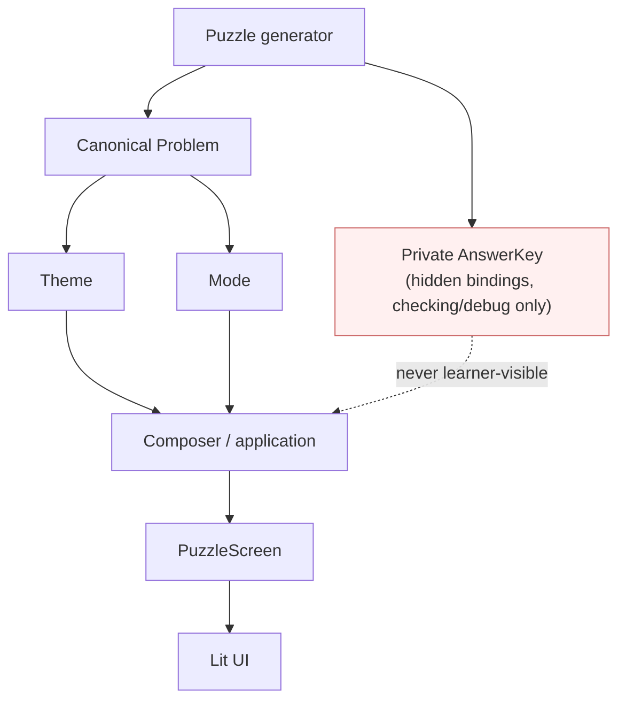
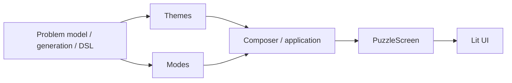

# Architecture contract: Problem × Theme × Mode

**Status:** authoritative architecture contract.

If older milestone prose, existing code, or an older ADR conflicts with this document, follow this contract and the newest accepted ADR until the conflict is deliberately resolved.

## Core composition



`Problem -> Theme -> Mode -> PuzzleScreen` is a conceptual composition, not a required execution order. Theme and Mode are independent peers over the same canonical `Problem`. The composer may evaluate either first or both independently; the result must not depend on ordering.

## Ownership

| Concern | Owner | May contain | Must not contain |
| --- | --- | --- | --- |
| Canonical mathematics | `Problem` | concepts, canonical quantity IDs/roles, generic mathematical dimensions, givens, relation, mathematical replay | scenario/theme ID, story text, learner-facing names, localized units, concrete theme IDs, task/mode, input provider |
| Hidden numeric solution | `AnswerKey` | complete bindings keyed by canonical quantity ID | browser-visible registry or `PuzzleScreen` state |
| Theme and language | Theme | story plan, story text, contextual labels, learner-facing variable names, contextual units/dimensions, locale resources | a rewritten `Problem`, concrete Mode imports, task-specific factories/checkers |
| Learning task | Mode | representation source/target, interaction state, semantic answer shape, checker policy, generic distractor semantics | concrete Theme/theme imports or scenario-specific quantity IDs |
| Learner-facing composition | Composer / application | selected Problem, Theme, Mode, locale/input mode, merged generic presentation contracts | hidden `AnswerKey` |
| Rendered use-case state | `PuzzleScreen` | shared story/context plus a discriminated task-specific state | assumptions that every task is quantities -> named equation |

## Canonical Problem

A generated `Problem` represents mathematics only. For the initial family its identity is equivalent to:

```text
total = base + count * unitValue
```

with canonical roles/IDs such as `base`, `count`, `unitValue`, and `total`. A drone theme may display these as `basePower`, `droneCount`, `dronePower`, and `totalPower`; a creator theme may display them as follower/post concepts. Neither mapping changes the `Problem` or its relation AST.

Mathematical generation therefore takes mathematical inputs such as seed, concepts and numeric constraints. It does not take `scenarioId`, `themeId`, locale, task/mode, or input provider.

The canonical DSL serializes only canonical mathematics and mathematical replay. Theme/scenario selection, localized names, story text and academic display choices are separate replay/presentation metadata.

## Theme

A Theme is a pure projection of a canonical `Problem` into learner-facing context. A useful conceptual contract is:

```ts
type ThemePresentation = {
  story: { text: string; plan: unknown };
  quantities: Readonly<Record<QuantityId, {
    label: string;
    variableName: string;
    unit?: string;
  }>>;
};

renderTheme(problem, themeId, locale, storySeed): ThemePresentation
```

A Theme may validate that its contextual units and wording are coherent with canonical roles. It must not return another `Problem`, rename IDs inside the AST, rewrite the relation, or generate Story->Quantities / NamedEquation task definitions.

## Mode

A Mode selects the representation edge being trained. Initial modes are:

- Story -> Quantities
- Quantities -> Named Equation

Free text and multiple choice are input providers within the same named-equation Mode, not distinct mathematical cases or themes.

Mode logic works with canonical semantic IDs/roles. Distractor relations are generated semantically from canonical math. Learner-facing labels for those relations are rendered later from a generic name map supplied by composition; the Mode does not import a concrete Theme.

## Composer and PuzzleScreen

The application selects a canonical Problem, Theme, Mode, locale and optional input provider and composes them:

```ts
composePuzzle({ problem, theme, mode, locale, inputMode }): PuzzleScreen
```

`PuzzleScreen` has shared context, including the active localized story, plus a discriminated union for Mode-specific source/target/input/feedback. Story -> Quantities uses the story as its source. Quantities -> Named Equation still displays the same story as context alongside the quantities.

Changing Theme, Mode, locale or input provider keeps the same canonical Problem and AnswerKey. Changing only the mathematical seed generates a different Problem.

## Required invariants

Treat supported dimensions as a Cartesian product:

```text
Problem(seed)
  × Theme(drone | creator | ...)
  × Mode(story->quantities | quantities->named-equation | ...)
  × Locale(en | nb | ...)
  × InputProvider(where applicable)
```

Architecture tests must prove:

1. Applying any Theme or Mode does not mutate the canonical `Problem`.
2. The same Problem/DSL/relation/AnswerKey is reused across every Theme and Mode.
3. Every supported Theme composes with every supported Mode.
4. Composition order is irrelevant.
5. Locale changes presentation only.
6. Hidden answer bindings never enter learner-visible screen/registry state.
7. Generic UI and Mode code do not import concrete Theme implementations.

Prefer exact semantic identity assertions (`expect(after).toEqual(before)`) over weaker checks that two themed problems merely evaluate to the same number or normalized shape.

## Dependency direction



Themes and Modes depend only on shared domain contracts, never on each other; their concrete registries meet only in composer/application code.

Themes and Modes may depend on shared domain contracts. They may not depend on each other. Concrete Theme registries and Mode registries meet only in application/composition code.

## Smells that require redesign before merge

- `if (themeId === ...)` inside mathematical generation or a Mode.
- `if (mode === ...)` inside a Theme.
- A Theme binding returns `{ problem: ... }`.
- A Theme rewrites quantity IDs, relation nodes or academic symbol maps on `Problem`.
- A scenario folder contains task-specific factories such as `named-equation-definition` or `story-quantities-definition`.
- A supposedly generic `PuzzleScreen` hardcodes one source/target edge.
- Adding a second Theme or Mode requires copying a large branch from the first.
- A test proves only arithmetic/normalized equivalence when the architecture requires object/semantic identity.

## Rule of two

The second implementation of an axis is the abstraction test. Before merging a second Theme, second Mode or second mathematical family, remove branching/duplication that couples the first implementation to another axis. Do not preserve the first implementation as the implicit generic API merely because it already works.
