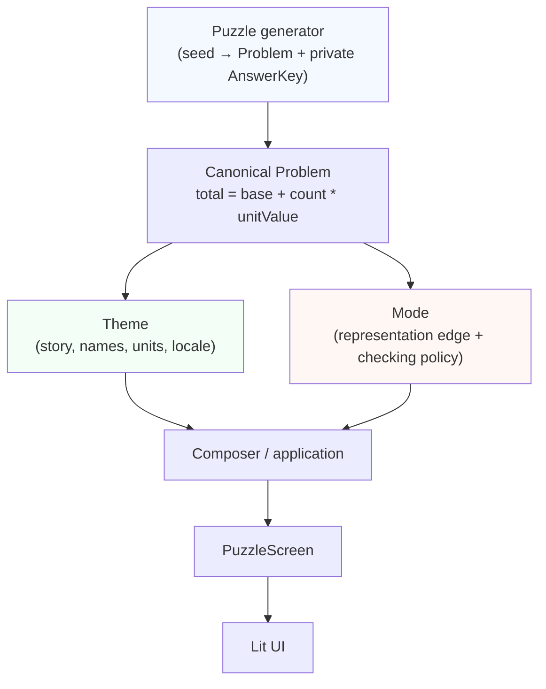

# Text Math Modeling Game — specification package

**Status:** Phase 1 implementation in progress, 19 September 2026. Milestones 0–8 behavior and the responsive graybox UI foundation exist. Later phases remain architectural direction rather than implementation scope.

Build a test-driven web puzzle for translating between natural-language situations, quantity models, named expressions, substituted expressions, and academic notation. The same deterministic semantic problem powers every representation.

**[Open the live demo](https://lars-erik.github.io/text-math-modeling-game/)**

Open pull requests that change the application are published as temporary previews at `https://lars-erik.github.io/text-math-modeling-game/pr-N/`, where `N` is the pull request number. CI also posts the concrete preview link on the pull request and removes the preview when the PR closes or merges.

## Reading order

1. [Product and learning loop](docs/01-product-and-learning-loop.md) — intent, representation graph, initial use cases.
2. [Problem × Theme × Mode architecture contract](docs/architecture-contract.md) — authoritative ownership, dependency and composition rules.
3. [Architecture and semantic domain](docs/02-architecture-and-domain.md) — AST, quantities, operations, validation, checking.
4. [DSL and representations](docs/03-dsl-and-representations.md) — canonical syntax, parsing, serialization, notation adapters.
5. [Procedural generation and themes](docs/04-generation-and-scenarios.md) — composable math generation, seeds, Theme/story templates.
6. [Graybox puzzles and UI](docs/05-graybox-core-loop.md) — initial Modes, two-way traversal, screen contract.
7. [TDD and approval testing](docs/06-testing-and-approvals.md) — golden masters, architecture invariants, use-case printers, properties, DOM testing.
8. [Phase 1 execution plan](docs/07-phase-1-plan.md) — small red/green/refactor milestones and acceptance criteria.
9. [Future roadmap](docs/08-future-roadmap.md) — architecture boundaries only.
10. [Technology decisions](docs/09-technology-decisions.md) — Lit, Svelte, Vue, React; Vite/Bun; parser and renderer trade-offs.
11. [Session persistence](docs/11-session-persistence.md) — local snapshots, replay versus resume, invalidation policy.

[Project agent agreement](AGENTS.md) defines architecture preflight for all agents; [source working agreement](src/AGENTS.md) adds the implementation TDD rhythm.

## Current vertical slice

The implemented mathematical family is:

```
total = base + count * unitValue
```

A seeded generator constructs valid cases by design and keeps the complete answer key private. The same generated mathematics can currently be bound to two deterministic scenarios:

- spaceship/drone power
- creator/follower growth

Both scenarios support English and Norwegian Bokmål resources while preserving the same semantic relationship and answer values.

The real application exposes four implemented learner transformations:

- Story → Quantities
- Quantities → Named Equation
- Named Equation → Academic Notation
- Academic Notation → Named Equation

Named and academic equations are parsed back into the canonical domain AST and checked structurally rather than by raw string comparison. Academic display uses a replaceable KaTeX adapter while the AST remains authoritative. The browser UI has a shared responsive shell, scenario/task/seed/locale controls, accessible interaction tests, and selected visual screenshot approvals. The application uses hash routing with a route name and its arguments in the hash query string, for example `#puzzle?seed=321&scenario=creator.followers&task=named-equation-to-academic-notation&language=nb`; an empty hash resolves to the Home destination and the public language parameter is `language`.

One canonical mathematical Problem composes independently with a Theme and a Mode; switching Theme, Mode, locale or input provider does not regenerate or rewrite the Problem. See the [Milestone 8 architecture note](docs/milestone-8-architecture.md) for the new representation and display boundaries. Session runs persist locally behind a small repository port; an in-progress run can be resumed after refresh and completed runs appear in Home history. See [Session persistence](docs/11-session-persistence.md) for the snapshot contract, run identity and invalidation policy.

## Architectural invariant



Problem, Theme and Mode are independent axes. Theme may present canonical facts as drones, followers or another theme without changing canonical quantity IDs/relation/DSL. Mode determines the representation edge without knowing which concrete Theme is active. The composer is the first layer allowed to select both.

The private `AnswerKey` remains separate from learner-visible Problem and browser state. Architecture tests should prove exact Problem identity and supported Theme × Mode × locale composition, not only equivalent arithmetic results.

## Development

Milestone 0a is pinned and verified with Node `v24.12.0` and npm `11.6.2`.
The implementation package is rooted in `src/` so the repository can add other technology packages later without restructuring this one.

```powershell
cd src
npm ci
npm run browser:install
npm run browser:doctor
npm run typecheck
npm test
npm run build
```

On Linux hosts with permission to install OS libraries, run `npm run browser:install:ci` instead of `npm run browser:install`. See [browser-test environment setup and recovery](docs/browser-testing.md) for Windows, Linux and agent instructions.

Approval tests write deterministic `*.received.*` files when a baseline is missing or changed. Received files are ignored by Git. Inspect the console diff and received file before manually promoting it to the corresponding committed `*.approved.*` file. Tests and CI never update approved files automatically.

`browser:install` installs the pinned Chromium revision in Playwright's standard user cache (shared across compatible checkouts, not under `node_modules`). `browser:doctor` checks its executable and attempts a headless launch without installing anything. `npm test` runs both the Node approval/property/unit suite and the headless Chromium interaction suite.

`npm test` also writes Vitest reports under `src/test-results/`:

- `src/test-results/node/junit.xml` and `src/test-results/node/index.html`
- `src/test-results/browser/junit.xml` and `src/test-results/browser/index.html`
- `src/test-results/browser/screenshots/` with fresh wide and mobile puzzle PNGs

Selected browser views also use Vitest's Playwright-backed screenshot matcher.
Their committed, co-located `__screenshots__` PNGs are visual approval baselines. Review
baseline changes like the text approvals; CI emits expected, actual and diff images
when the rendered result exceeds the configured tolerance.

The GitHub Actions workflow uploads `src/test-results/` and the committed or newly
received visual baselines as an artifact even when tests fail, so CI logs stay useful
while still providing downloadable reports and screenshots.

### Browser screenshot approvals

[](src/features/puzzle/ui/__screenshots__/puzzle-screenshots.browser.test.ts/drone-power-wide-chromium-linux.png)

[](src/features/puzzle/ui/__screenshots__/puzzle-screenshots.browser.test.ts/creator-narrow-nb-chromium-linux.png)

## CI/CD

- Workflow: `.github/workflows/ci-pages.yml`
- Validation runs for `main` and pull requests targeting `main`; documentation-only and repository-agent-skill-only changes are ignored by the app build workflow.
- CI runs:
  1. `npm ci`
  2. `npm run browser:install:ci` (Chromium and Linux libraries)
  3. `npm run typecheck`
  4. `npm test`
  5. `npm run build` with `/text-math-modeling-game/` on `main` or `/text-math-modeling-game/pr-N/` for PR previews.
- Test reports are uploaded as artifacts and published in the GitHub Actions run UI from JUnit XML (`dorny/test-reporter`).
- A successful `main` build updates the root of the `gh-pages` publishing branch while preserving open PR preview directories.
- A successful same-repository PR build updates only `pr-N/`; closing or merging the PR removes that directory and its CI-posted preview link.
- The first preview deployment bootstraps the production root from `main`, so switching Pages publishing mode does not expose unmerged PR code at the live demo URL.

GitHub Pages URL: `https://lars-erik.github.io/text-math-modeling-game/`

One-time repository setting: in **Settings → Pages**, choose **Deploy from a branch**, select **`gh-pages`**, and publish from **`/ (root)`**.
