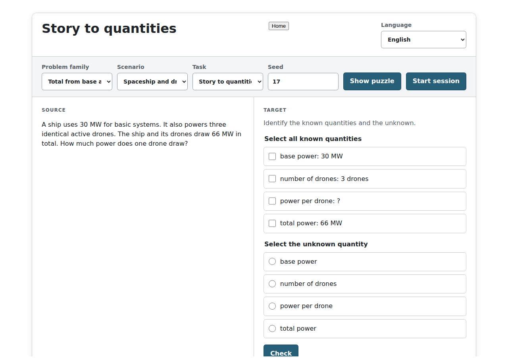
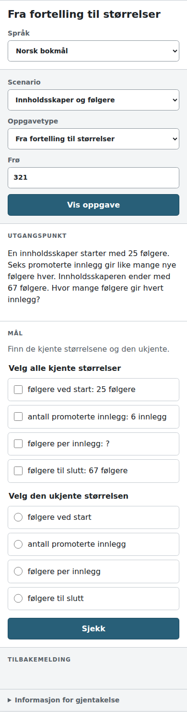

# Text Math Modeling Game — specification package

**Status:** Phase 1 implementation in progress, 19 September 2026. Milestones 0–7 and the responsive graybox UI foundation are implemented; Milestone 7.5 is the next architecture/UI step before academic notation. Later phases remain architectural direction rather than implementation scope.

Build a test-driven web puzzle for translating between natural-language situations, quantity models, named expressions, substituted expressions, and academic notation. The same deterministic semantic problem powers every representation.

## Reading order

1. [Product and learning loop](docs/01-product-and-learning-loop.md) — intent, representation graph, initial use cases.
2. [Architecture and semantic domain](docs/02-architecture-and-domain.md) — AST, quantities, operations, validation, checking.
3. [DSL and representations](docs/03-dsl-and-representations.md) — editable syntax, parsing, serialization, notation.
4. [Procedural generation and scenarios](docs/04-generation-and-scenarios.md) — composable concept generators, seeds, story templates.
5. [Graybox puzzles and UI](docs/05-graybox-core-loop.md) — initial exercises, two-way traversal, screen contract.
6. [TDD and approval testing](docs/06-testing-and-approvals.md) — golden masters, use-case printers, properties, DOM testing.
7. [Phase 1 execution plan](docs/07-phase-1-plan.md) — small red/green/refactor milestones and acceptance criteria.
8. [Future roadmap](docs/08-future-roadmap.md) — architecture boundaries only.
9. [Technology decisions](docs/09-technology-decisions.md) — Lit, Svelte, Vue, React; Vite/Bun; parser and renderer trade-offs.

[Codex working agreement](src/AGENTS.md) specifies how an implementation agent should proceed.

## Current vertical slice

The implemented mathematical family is:

```
total = base + count * unitValue
```

A seeded generator constructs valid cases by design and keeps the complete answer key private. The same generated mathematics can currently be bound to two deterministic scenarios:

- spaceship/drone power
- creator/follower growth

Both scenarios support English and Norwegian Bokmål resources while preserving the same semantic relationship and answer values.

The implemented learner transformations are:

- Story → Quantities
- Quantities → Named Equation

Named equations are parsed back into the canonical domain AST and checked structurally rather than by raw string comparison. The browser UI has a shared responsive shell, scenario/seed controls, accessible interaction tests, and selected visual screenshot approvals.

The next step is [Milestone 7.5](https://github.com/lars-erik/text-math-modeling-game/issues/13): separate the generated/scenario-bound modeling case from the selected puzzle task, expose both existing task types through the real application menu, and make seed + scenario + task + locale fully replayable through the URL. Milestone 8 then adds substitution and academic notation.

## Architectural invariant

```
Generator ──────┐
DSL parser ─────┼──> semantic Problem AST ──> puzzle/use-case ──> screen model
                │            │                      │                  │
                │            ├──> DSL/LaTeX printers └──> trace printer  ├──> Lit view
                │            └──> scenario renderer                     └──> approval
                └── DSL serializer (AST → text)
```

The domain remains usable from tests and command-line tooling without a browser. All generated cases are reproducible with seed + generator version/configuration. The test suite includes exact invariants, property tests, human-reviewed text approvals, browser interaction tests, and selected screenshot approvals.

The private `AnswerKey` remains separate from learner-visible problem and browser state. Scenario and locale changes are tested to preserve the underlying mathematical model and answer values.

## Development

Milestone 0a is pinned and verified with Node `v24.12.0` and npm `11.6.2`.
The implementation package is rooted in `src/` so the repository can add other technology packages later without restructuring this one.

```powershell
cd src
npm ci
npm run browser:install
npm run typecheck
npm test
npm run build
```

Approval tests write deterministic `*.received.*` files when a baseline is missing or changed. Received files are ignored by Git. Inspect the console diff and received file before manually promoting it to the corresponding committed `*.approved.*` file. Tests and CI never update approved files automatically.

`browser:install` keeps Playwright's Chromium binaries under `src/node_modules`; it does not write them to the user-level Playwright cache. `npm test` runs both the Node approval/property/unit suite and the headless Chromium interaction suite.

`npm test` also writes Vitest reports under `src/test-results/`:

- `src/test-results/node/junit.xml` and `src/test-results/node/index.html`
- `src/test-results/browser/junit.xml` and `src/test-results/browser/index.html`
- `src/test-results/browser/screenshots/` with fresh wide and mobile puzzle PNGs

Selected browser views also use Vitest's Playwright-backed screenshot matcher.
Their committed, co-located `__screenshots__` PNGs are visual approval baselines. Review
baseline changes like the text approvals; CI emits expected, actual and diff images
when the rendered result exceeds the configured tolerance.

The GitHub Actions workflow uploads `src/test-results/` and the committed or newly
received visual baselines as an artifact even when tests fail, so CI logs stay useful
while still providing downloadable reports and screenshots.

### Browser screenshot approvals

[](src/features/puzzle/ui/__screenshots__/puzzle-screenshots.browser.test.ts/drone-power-wide-chromium-linux.png)

[](src/features/puzzle/ui/__screenshots__/puzzle-screenshots.browser.test.ts/creator-narrow-nb-chromium-linux.png)

## CI/CD

- Workflow: `.github/workflows/ci-pages.yml`
- Validation runs on every push so feature branches receive the same checks as `main`.
- CI runs:
  1. `npm ci`
  2. `npm run browser:install`
  3. `npm run typecheck`
  4. `npm test`
  5. `npm run build -- --base=/text-math-modeling-game/`
- Test reports are uploaded as artifacts and published in the GitHub Actions run UI from JUnit XML (`dorny/test-reporter`).
- A successful `main` build is deployed to GitHub Pages using the official `upload-pages-artifact` + `deploy-pages` actions flow. Feature-branch builds validate and upload test artifacts but do not deploy.

GitHub Pages URL: `https://lars-erik.github.io/text-math-modeling-game/`

One-time repository setting: in **Settings → Pages**, set **Source** to **GitHub Actions**.
